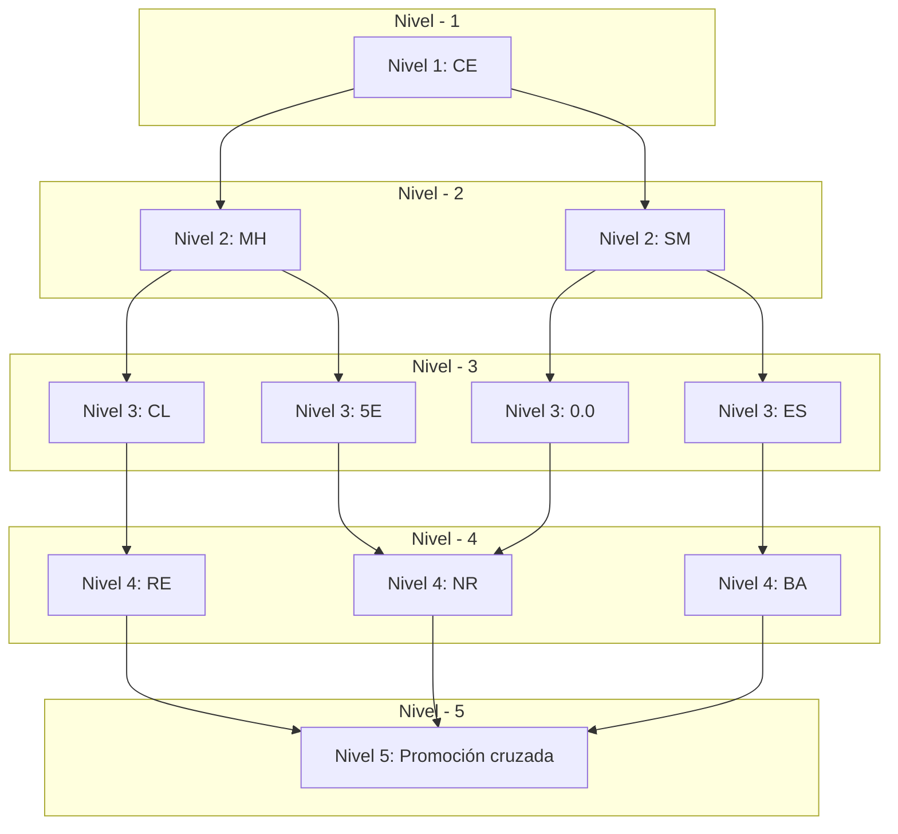

## Clases de Artículos

Permite definir las distintas clases que conforman un artículo, es decir, su tipo y subtipos permitiendonos tener una jerarquía organizada de cara a obtener datos estadísticos.

Se permite definir un artículo en un máximo de 5 niveles jerarquicos, desde el punto de vista más general al más especifico.

***Se recomienda tener definidos al menos los tres prmieros niveles*** para un **correcto** funcionamiento del módulo de estadisticas.

La pantalla principal de mantenimiento de clases nos muestra una vista previa de todas las clases que tenemos dadas de alta.
Al situarnos sobre una de ellas o haciendo doble click se nos abrirá el menú de modificación.
Este menú sirve para modificar la clase seleccionada o para dar una nueva clase de alta mediante el botón de Alta o ***Ctrl + A***

En la imagen se pueden apreciar los siguientes campos:

- **Código**: Código de la clase. (Se recomienda una combinación de 2 sílabas)
- **Nivel- Clase**: Nivel de clase.
-**Nombre**: Nombre descriptivo de la clase.
- **Tarifa Liquidación**: Permite especificar una de las seis posibles tarifas de venta que se aplicará a la hora de generar la liquidación con los proveedores.
- **Tarifa Inc x Ud**: -Por rellenar-
- **P/Coste a Dtos**: Permite especificar si se aplicará ***por omisión*** el precio de coste a los descuentos.
- **Cuenta Ventas**: Cuenta de venta asociada a la clase.
- **Cuenta Compras**: Cuenta de compras asociada a la clase.
- **Cuenta Manipulación**: Cuenta de manipulación asociada a la clase.
- **Dto Máximo %/-Eur**: Descuento máximo en porcentaje o en euros aplicados a la clase.
- **%Mrg PVPX**: % De margen de beneficio aplicado a las tarifas de venta.

Esquema de clases de artículo

En este gráfico tenemos como ejemplo:

- Nivel 1: Cerveza (CE).

- Nivel 2: Mahou (MH) o San Miguel (SM).

- Nivel 3: Clásica (CL), Cinco Estrellas (5E), Sin alcohol (0.0) o Especial (ES).

- Nivel 4: Retornable (RE), No Retornable (NR), Barril (BA).
